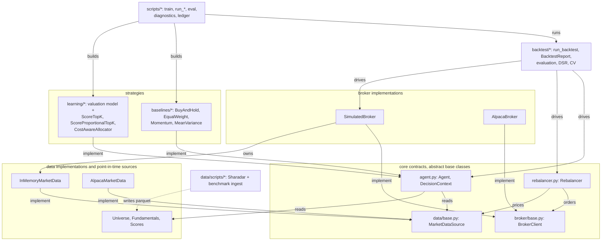
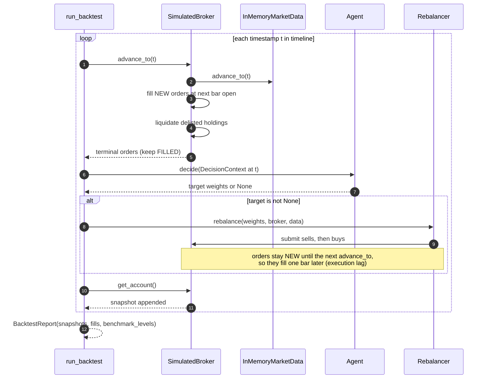
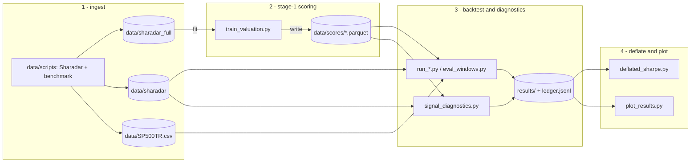

# Value_Portfolio

This document explains what every module in the project does and how the pieces
fit together. It is a reference companion to the code, describing the code as it
stands.

## Contents

1. [Overview](#1-overview)
2. [Repository layout](#2-repository-layout)
3. [Core abstractions and the trading seam](#3-core-abstractions-and-the-trading-seam)
4. [Broker layer](#4-broker-layer)
5. [Data layer](#5-data-layer)
6. [Baselines](#6-baselines)
7. [Backtesting and evaluation](#7-backtesting-and-evaluation)
8. [Learning pipeline](#8-learning-pipeline)
9. [Scripts and the experiment ledger](#9-scripts-and-the-experiment-ledger)
10. [Data pipeline](#10-data-pipeline)
11. [Testing, tooling, and reproducibility](#11-testing-tooling-and-reproducibility)

---

## 1. Overview

The system manages a long-only S&P 500 equity portfolio and measures itself
against the index. It behaves like an investor who rebalances on a cadence, not
a day trader. The design is a two-stage pipeline:

- **Stage 1, the valuation model.** Offline machine learning reads point-in-time
  fundamentals and produces one score per stock per month. A score is an estimate
  of how mispriced a name is relative to what its fundamentals imply.
- **Stage 2, the allocation layer.** An online agent reads those scores at the
  simulation clock and turns them into target portfolio weights under explicit
  constraints (long-only, top-K, turnover-aware).

Two invariants run through the whole codebase and explain most of the design
choices:

- **Money is `Decimal`, never `float`, in the trading path.** Prices, quantities,
  cash, and equity are exact decimals. Floats appear only inside numeric
  optimisers and the offline statistics, and are converted back to `Decimal` at
  the boundary. Every external adapter converts with `Decimal(str(value))` to
  avoid binary-float drift.
- **Every read is point-in-time.** No step ever sees data the market had not yet
  published. The simulation clock truncates market data, index membership is
  reconstructed as it stood on each date, fundamentals are anchored on their
  public filing date, and orders fill on the next bar rather than the bar that
  triggered them.

The package layers depend on each other in one direction only. Strategies depend
on the abstractions, not on the concrete broker or data source. In the diagram
below each arrow points from a component to what it depends on, labelled with the
relationship; the four boxed groups are the layers.



---

## 2. Repository layout

```
src/value_portfolio/        the installable library
  agent.py                  the strategy contract (Agent, DecisionContext)
  rebalancer.py             weights to market orders, the single trading seam
  config.py                 pydantic settings for Alpaca and Sharadar credentials
  broker/                   execution API + Simulated and Alpaca implementations
  data/                     market-data API, point-in-time sources, loaders
  baselines/                non-learning strategies
  learning/                 two-stage pipeline (needs the `learning` extra)
  backtest/                 run_backtest driver, report, evaluation harness

scripts/                    runnable train / backtest / evaluate / plot scripts
data/scripts/               Sharadar and benchmark ingestion

data/
  sharadar_full/            broad estimation panel (~4,800 US common stocks)
  sharadar/                 S&P 500 traded subset, survivorship-free incl. delisted
  scores/                   stage-1 output, one parquet per model/target variant
  SP500TR.csv               benchmark index level (total return)

results/                    committed experiment record: one JSON per run + ledger
models/                     cut PPO policies (not committed)
paper/                      the thesis manuscript and its figures
docs/                       TRAINING_ITERATIONS.md (stage-1 changelog) + notes
tests/                      pytest suite mirroring the src/ layout
```

The two data roots are easy to confuse. `data/sharadar_full/` is the
broad panel the valuation model is *fitted* on. `data/sharadar/` is the S&P 500
subset the portfolios are *traded and evaluated* on. Scores are learned broad,
but selection and evaluation always filter point-in-time to the S&P 500.

| Root | Contents | Produced by | Consumed by |
| --- | --- | --- | --- |
| `data/sharadar_full/` | ~4,800 US common stocks | `data/scripts/full/` bulk mirror | `scripts/train_valuation.py` |
| `data/sharadar/` | S&P 500 subset incl. delisted | `data/scripts/fetch_sharadar_*.py` | the `run_*` backtests, diagnostics |

---

## 3. Core abstractions and the trading seam

Four abstract base classes decouple strategy logic from execution and data. A
strategy is written against the contracts and never against a concrete broker or
data source, which lets the same agent run in a backtest and against Alpaca
unchanged.

### `agent.py`: the strategy contract

`DecisionContext` is a frozen, slotted dataclass bundling everything an agent may
observe at one step:

```python
@dataclass(frozen=True, slots=True)
class DecisionContext:
    now: datetime
    account: AccountSnapshot
    data: MarketDataSource
    universe: Universe | None = None
    fundamentals: FundamentalsDataSource | None = None
    scores: ScoreSource | None = None
```

`Agent` has a single abstract method:

```python
class Agent(ABC):
    @abstractmethod
    def decide(self, context: DecisionContext) -> dict[str, Decimal] | None: ...
```

The return value is a `ticker -> weight` mapping. Returning `None` means "no
change this step". `RebalancingAgent(Agent)` is the base for agents that act only
every `rebalance_every` steps; its protected `_should_rebalance()` returns whether
the current step is a rebalance step and advances an internal counter. Every
baseline and every stage-2 allocator subclasses it. `require_unique_symbols` is a
shared validator that rejects empty or duplicate symbol lists.

`DecisionContext` is the join point of all the data abstractions, so an agent can
read prices, its own account, and (when supplied) index membership, fundamentals,
and scores, without any of those being wired into the agent's constructor.

### `rebalancer.py`: the trading seam

The `Rebalancer` is the single place where abstract target weights become
concrete broker orders.

```python
class Rebalancer:
    def __init__(self, cash_buffer: Decimal = Decimal("0.02"),
                 min_trade_notional: Decimal = Decimal("0")) -> None: ...
    def rebalance(self, target_weights: Mapping[str, Decimal],
                  broker: BrokerClient, data: MarketDataSource) -> list[Order]: ...
```

The algorithm:

1. Validate the weights. Negative weights are rejected (no shorting). The sum may
   not exceed 1, with a `1e-9` tolerance so that `1/n` rounding does not trip the
   check. Under-allocation is allowed; the remainder stays in cash.
2. Read equity from the account and compute `deployable = equity * (1 - cash_buffer)`.
   The default 2% buffer leaves room for fill-time slippage and commission.
3. For every symbol currently held or targeted, compute the target quantity at the
   mid price `(bid + ask) / 2`, diff it against the held quantity, and skip trades
   whose notional falls below `min_trade_notional`.
4. Submit **all sells first, then all buys**. Selling frees the cash the buys need.

Note that the mid price equals the bar close in a backtest, because
`InMemoryMarketData` quotes the close on both bid and ask.

### The seam, end to end

```
Agent.decide(context) -> target weights (or None)
        │
        ▼
Rebalancer.rebalance(weights, broker, data)
        │  sells before buys, at the mid price, within the cash buffer
        ▼
BrokerClient.sell(...) / BrokerClient.buy(...)  -> market orders
```

### `config.py`: credentials

Two `pydantic-settings` classes read from `.env` and never hardcode secrets.
`AlpacaSettings` (prefix `ALPACA_`) carries `api_key`, `api_secret`, and
`paper: bool = True`. `SharadarSettings` (prefix `SHARADAR_`) carries
`us_bundle_api_key`. Both ignore unknown env keys. They are consumed by the
Alpaca broker and data adapters and by the ingestion scripts.

---

## 4. Broker layer

`broker/` defines the execution contract and its two implementations. The
contract is market-orders-only and long-only in practice, which matches the
investor framing.

### `broker/types.py`: value types

All frozen, slotted dataclasses with `Decimal` money fields, plus two string
enums. `OrderSide` is `BUY` / `SELL`. `OrderStatus` is `NEW`, `PARTIALLY_FILLED`,
`FILLED`, `CANCELED`, `REJECTED`, `EXPIRED`. `Position` carries `symbol`, `qty`,
`avg_entry_price`, `market_value`, `unrealized_pl`, `current_price`. `Order`
carries identity and routing fields plus the fill fields `filled_qty`,
`filled_avg_price`, `filled_at`. `AccountSnapshot` carries `cash`, `equity`,
`buying_power`, a `timestamp`, and the tuple of positions.

### `broker/exceptions.py`: error hierarchy

`BrokerError` is the base. Subclasses are `AuthenticationError`,
`OrderRejectedError`, `InsufficientFundsError`, and `SymbolNotFoundError`. The
two brokers raise the same hierarchy, which makes them substitutable.

### `broker/base.py`: the `BrokerClient` contract

Abstract methods cover account and position reads (`get_account`,
`get_positions`, `get_position`), execution (`buy`, `sell`, both taking
`symbol`, `qty: Decimal`, and an optional `client_order_id`), order management
(`cancel_order`, `get_order`, `list_orders`), and the calendar
(`is_market_open`).

### `broker/simulated.py`: `SimulatedBroker`

The deterministic backtest execution engine. It owns an `InMemoryMarketData`
instance and drives its clock, which guarantees reproducible next-bar fills.

```python
def __init__(self, market_data: InMemoryMarketData,
             starting_cash: Decimal = Decimal("100000"),
             commission_per_share: Decimal = Decimal("0"),
             slippage_bps: Decimal = Decimal("0"),
             account_id: str = "sim-account",
             delisting_fill_price: Callable[[Decimal], Decimal] | None = None) -> None: ...
```

Behaviours:

- **Clock.** `advance_to(timestamp)` moves the market-data clock forward, then
  tries to fill every `NEW` order, then liquidates any delisted holdings. It
  returns the orders that reached a terminal state this step. `reset()` clears all
  state and rewinds the clock.
- **Execution lag.** Orders submitted during a step do not fill during that step.
  `_try_fill` fills at the *next bar's open* after the order's submission time
  (`market_data.next_bar_after`), and only once that bar is visible. This one-bar
  delay is the mechanism that prevents look-ahead: a decision made from the bar at
  `t` cannot transact at that same bar.
- **Costs.** `_apply_slippage` moves the fill price unfavourably by `slippage_bps`
  (up for buys, down for sells). Commission is `commission_per_share * qty`. A buy
  whose total cost exceeds cash is rejected rather than filled on margin;
  `buying_power` equals cash, so there is no leverage.
- **Marking.** `get_account` computes `equity = cash + sum(position.market_value)`
  with positions freshly marked to the latest visible bar close.
- **Delisting.** `_liquidate_delisted` sells any position whose last bar is now
  behind the clock at `delisting_fill_price(last_close)` (the last close by
  default), so the book never carries a stale mark for a name that stopped
  trading.
- **Determinism.** `is_market_open` checks the sim clock against bar timestamps
  and never calls `datetime.now()`, so a run depends only on its inputs.

### `broker/alpaca.py`: `AlpacaBroker`

The live and paper adapter over `alpaca-py`'s `TradingClient`. It translates SDK
objects into the internal frozen dataclasses (`_to_position`, `_to_order`), every
numeric field through `Decimal(str(...))`. `_ALPACA_STATUS_MAP` collapses
Alpaca's many raw statuses onto the six-member internal `OrderStatus` and raises
`BrokerError` on anything unrecognised. `_translate_errors` is a context manager
that inspects `APIError` text and re-raises it as the matching `BrokerError`
subclass, so the two brokers present one error surface. `alpaca-py` is
imported lazily so the dependency is only needed when the adapter is actually
used.

---

## 5. Data layer

`data/` defines the read-only market-data contract, its implementations, and the
three point-in-time sources that feed richer observations without look-ahead. New
information enters as a parallel clock-controlled source rather than by widening
`MarketDataSource`.

### `data/types.py` and `data/base.py`

`Quote` and `Bar` are frozen, slotted, all-`Decimal` dataclasses. `Bar` holds
OHLCV plus a `timeframe` string. `MarketDataSource` has two abstract methods:
`get_quote(symbol)` for the most recent quote, and
`get_bars(symbol, start, end, timeframe)` for OHLCV over an inclusive window.
`data/exceptions.py` provides `MarketDataError` and `SymbolNotAvailableError`.

### `data/in_memory.py`: `InMemoryMarketData`

The clock-controlled backtest data source. Reads are truncated at a mutable,
monotonic clock so a simulation never sees future bars.

- `__init__` sorts each symbol's bars by timestamp and precomputes parallel
  timestamp lists for binary search. The clock starts at the earliest bar.
- `now` is the clock. `advance_to` moves it forward and rejects backward moves.
  `timeline` returns every distinct bar timestamp ascending and is deliberately
  *not* clock-truncated, because it is the trading calendar the backtester walks
  and trading dates leak no prices.
- `get_quote` synthesises a quote from the latest visible bar, quoting the close
  on both bid and ask. `get_bars` truncates the window at `min(end, clock)`.
- Three helpers back the `SimulatedBroker`, all `O(log n)` via `bisect_right`:
  `latest_bar` (most recent bar at or before the clock, used for marking),
  `is_delisted` (last bar strictly before the clock), and `next_bar_after` (the
  next bar strictly after a timestamp, but only if already visible, used for
  fills).

### `data/alpaca.py`: `AlpacaMarketData`

The live historical adapter over `StockHistoricalDataClient`. `get_bars` requests
`Adjustment.ALL`, so bars are split- and dividend-adjusted (a total-return series;
unadjusted bars would make splits look like crashes). `_parse_timeframe` maps
strings like `"1Day"` and `"5Min"` to the SDK's `TimeFrame`. Its own
`_translate_errors` maps `APIError` to `SymbolNotAvailableError` or
`MarketDataError`. Prices convert through `Decimal(str(...))`.

### `data/universe.py`: point-in-time index membership

`Universe` has one method, `members_at(date) -> set[str]`, returning the symbols
that were index members as of `date` with no future leakage. `InMemoryUniverse`
stores each symbol's membership as inclusive `(start, end)` intervals, where
`end is None` means still a member and multiple intervals handle a name that
leaves and rejoins. Backtesting against reconstructed membership rather than
today's index avoids survivorship bias.

### `data/fundamentals.py`: point-in-time fundamentals

`FundamentalsDataSource.value(symbol, field, as_of, *, dimension="ART")` returns
the value of `field` from the most recent filing known by `as_of`, or `None`.
Safety is anchored on `datekey`, the date a filing became public, not the fiscal
period end, so nothing is visible before the market saw it. `FundamentalRecord`
carries `symbol`, `dimension`, `datekey`, and a `values` mapping. The default
dimension `ART` is as-reported trailing twelve months. `InMemoryFundamentals`
groups records into per-`(symbol, dimension)` sorted lists and does the as-of
lookup with `bisect_right`. Only as-reported dimensions are ever used; restated
history is not.

### `data/scores.py`: point-in-time scores

The stage-1 output as a clock-controlled source. `ScoreRecord` carries `symbol`,
a `date` anchor, and a `Decimal` `score`. `ScoreSource.score(symbol, as_of)`
returns the most recent score computed by `as_of`. `InMemoryScores` uses the same
bisect pattern as fundamentals. `load_scores_from_parquet(path, symbols=None)`
reads the `date, ticker, score` parquet that `scripts/train_valuation.py` writes,
converting scores through `Decimal(str(value))` and treating naive dates as UTC.

### `data/loaders.py` and `data/sharadar.py`: building an `InMemoryMarketData`

`loaders.py` has `load_bars_from_alpaca(...)`, which pulls bars per symbol from
`AlpacaMarketData` and assembles one `InMemoryMarketData`. `sharadar.py` is the
only module in `src/` that touches pandas and pyarrow; callers see plain
`Decimal` and `datetime` types. It provides:

- `load_universe_from_sharadar(...) -> InMemoryUniverse` from a membership CSV.
- `load_bars_from_sharadar(symbols, start, end, *, price="closeadj", ...)`, which
  scales the whole OHLC bar onto one basis in `Decimal`. `price` selects
  total-return (`closeadj`, the default), raw (`closeunadj`), or split-adjusted
  (`close`).
- `load_fundamentals_from_sharadar(...) -> InMemoryFundamentals`, which reads only
  the requested symbols, dimensions, and columns; with `fields=None` it loads a
  curated default set of the fields the model needs.

Filters are pushed into the parquet reader so only the requested slice is read.

---

## 6. Baselines

Four non-learning strategies in `baselines/`. Each implements the agent contract,
uses `require_unique_symbols`, and (except mean-variance) allocates equal
`Decimal` weights. They are the yardsticks every learned strategy must beat.

- **`BuyAndHold`** allocates equal weight to a fixed basket once, then returns
  `None` forever. It is the passive benchmark inside the traded universe.
- **`EqualWeight(RebalancingAgent)`** returns an equal-weight target every
  `rebalance_every` steps, which bounds turnover and cost.
- **`Momentum(RebalancingAgent)`** is cross-sectional momentum (Jegadeesh and
  Titman 1993). `__init__(symbols, lookback=126, skip=0, top_k=None,
  rebalance_every=21, timeframe="1Day")`. On each rebalance it computes each
  name's return over the lookback (optionally skipping the most recent `skip`
  bars), ranks descending, and holds the top-K at equal weight.
- **`MeanVariance(RebalancingAgent)`** is Markowitz (1952). `__init__(symbols,
  lookback=252, mode="min_var", risk_aversion=Decimal("1"), ridge=Decimal("1e-6"),
  rebalance_every=21, timeframe="1Day")`. `min_var` minimises `(1/2) wᵀΣw`;
  `mean_var` minimises `(γ/2) wᵀΣw − μᵀw`. It solves with SLSQP under a
  sum-to-one constraint and `[0, 1]` bounds, with a ridge on the covariance
  diagonal for conditioning. This is the one baseline that computes in float
  internally; `_to_decimal_weights` clips, normalises, and quantizes **down**
  (`ROUND_DOWN`, `1e-6` quantum) so the weights can never sum above 1, matching
  the rebalancer's validation.

---

## 7. Backtesting and evaluation

`backtest/` holds the driver, the report with all portfolio metrics, and the
evaluation harness (multi-window distributions, Deflated Sharpe, purged and
combinatorial cross-validation). A division of labour runs through the package:
the trading and reporting path is exact `Decimal`, while the offline statistical
code is `float`/`numpy`. Two separate stats modules reflect that split.

### `backtest/driver.py`: `run_backtest`

The single entry point walks the timeline once and wires the agent, rebalancer,
and broker together.

```python
def run_backtest(agent, broker, data, timeline=None, rebalancer=None,
                 benchmark=None, universe=None, fundamentals=None,
                 scores=None) -> BacktestReport: ...
```

Each iteration over a timestamp `t`:

1. `broker.advance_to(t)` advances the clock and fills orders submitted on prior
   steps. Only `FILLED` orders are kept in the fills log.
2. A frozen `DecisionContext` is built for `t`.
3. `agent.decide(ctx)` returns target weights or `None`.
4. If not `None`, `rebalancer.rebalance(...)` submits orders that will fill on the
   *next* `advance_to`.
5. The account snapshot is recorded, and the benchmark level at `t` if a benchmark
   is attached.



A decision made at `t` produces orders that fill at the next bar's open, so the
snapshot at `t` reflects fills from earlier decisions. This is the built-in
execution lag.

### `backtest/report.py`: `BacktestReport`

A frozen dataclass over the snapshots, fills, and optional benchmark levels, with
every metric derived as a property or method in `Decimal`.

| Metric | Definition |
| --- | --- |
| `total_return` | `(final − start) / start` |
| `cagr` | annualised on calendar time (`elapsed / 365.25 days`), `None` if equity non-positive |
| `volatility(ppy=252)` | annualised sample std of periodic returns |
| `sharpe_ratio(ppy=252)` | `mean/std * sqrt(ppy)`, risk-free rate 0 |
| `max_drawdown` | largest peak-to-trough fractional decline (non-positive) |
| `benchmark_return` | index return over its first and last known levels |
| `active_return` | `total_return − benchmark_return` |
| `tracking_error(ppy=252)` | annualised std of the active-return series |
| `information_ratio(ppy=252)` | mean active return over its std, annualised |
| `beta` | `cov(r_p, r_b) / var(r_b)`, CAPM |
| `jensens_alpha(ppy=252)` | `(mean(r_p) − beta·mean(r_b)) · ppy` |
| `turnover` | gross fill notional over starting equity (a multiple) |

The variance in `beta`
is computed as `sample_cov(bench, bench)`, covariance with itself rather than
`std**2`, so beta stays exactly 1 when the portfolio tracks the benchmark
identically. `cagr` uses wall-clock elapsed time, not bar count, so it is
correct regardless of how many trading days fall in the window. `summary()`
renders all of this, appending a `-- vs benchmark --` block when a benchmark is
attached.

### `backtest/benchmark.py`: `BenchmarkSeries`

A look-ahead-safe level series (for example the S&P 500 total-return index). It
stores ascending timestamps and positive levels as two parallel tuples, so
`level_at(when)` is an `O(log n)` bisect returning the most recent level at or
before `when`, or `None` before the first date. Built via `from_levels` or
`from_csv` (which parses `data/SP500TR.csv` with the stdlib `csv` module,
localising dates to UTC midnight to match engine timestamps).

### `backtest/series.py`: plottable and serialisable series

`EquitySeries` bundles timestamps, the equity curve, and the optional benchmark.
`series_from_report` builds it from a report. `series_to_dict` and
`series_from_dict` round-trip it to JSON with quantised, stringified decimals.
`normalized_levels` rebases a series to growth-of-1, and `drawdown_levels`
produces the underwater series whose minimum equals `max_drawdown`. These feed the
plotting script and the stored artifacts.

### `backtest/_stats.py` and `backtest/statistics.py`

`_stats.py` holds the exact-arithmetic primitives used by the report and the
evaluator: `mean`, `median`, Bessel-corrected `sample_std`, and `sample_cov`.

`statistics.py` is the offline float module implementing the Bailey and López de
Prado (2014) machinery:

- `per_period_sharpe(returns)`, plus `sample_skewness` and `sample_kurtosis`
  (non-excess, Gaussian is 3.0).
- `probabilistic_sharpe_ratio(observed_sr, *, sr_benchmark, n_obs, skewness,
  kurtosis)`: the probability that the true Sharpe exceeds a benchmark, given the
  observed Sharpe and the return distribution's higher moments.
- `expected_max_sharpe(n_trials, *, sr_variance)`: the expected maximum Sharpe of
  `n_trials` unskilled trials, the deflation benchmark.
- `deflated_sharpe_ratio(observed_sr, *, n_trials, sr_variance, n_obs, skewness,
  kurtosis)`: composes the two above. After trying many variants, it answers
  whether the best one's Sharpe is still likely above zero once you correct for
  the number of trials.

### `backtest/evaluation.py`: multi-window evaluator

Runs the same strategy over many time windows and aggregates each metric into a
distribution rather than a single number.

- `Window(start, end)` with an inclusive span. `rolling_windows(start, end, *,
  window_years=5, step_months=12)` generates overlapping windows by calendar
  arithmetic.
- A module-level registry maps twelve metric names to report extractors.
- `evaluate_windows(windows, run)` is the driver. `run` is a caller-supplied
  closure that builds a fresh agent and broker for each window and returns a
  report (or `None` to skip). Keeping construction in the closure guarantees no
  state leaks between windows.
- `MultiWindowEvaluation` aggregates the results. `metric_values` returns a metric
  across windows, skipping windows where it is undefined; `summary()` renders mean,
  std, min, median, and max per metric; `evaluation_to_dict` serialises the whole
  thing, optionally embedding each window's series.

The window count here is a natural `n_trials` for the Deflated Sharpe.

### `backtest/cross_validation.py`: purged and combinatorial CV

López de Prado's cross-validation for time series with overlapping labels, as
pure index arithmetic.

- `purged_kfold_splits(n_samples, *, n_splits=5, label_span=0, embargo=0)`: each
  contiguous, time-ordered fold is the test set once. Training samples whose label
  horizon (`label_span` bars forward) overlaps the test block are **purged**, and
  samples within `embargo` bars after the test block are dropped to kill
  serial-correlation leakage.
- `combinatorial_purged_splits(n_samples, *, n_groups=6, n_test_groups=2, ...)`:
  tests every choice of `n_test_groups` out of `n_groups` contiguous groups,
  purged and embargoed around each chosen block. This yields `C(n_groups,
  n_test_groups)` backtest paths from limited data;
  `n_combinatorial_paths(n_groups, n_test_groups)` returns that count.
- `PurgedKFold` is a scikit-learn-style splitter wrapping `purged_kfold_splits`,
  so the purge and embargo carry into any sklearn cross-validation loop.

The number of CV paths is exactly the trial count that feeds the Deflated Sharpe:
CPCV generates the distribution of Sharpes across paths, and the DSR corrects the
best path for that multiplicity.

---

## 8. Learning pipeline

`learning/` is the two-stage pipeline. It needs the optional `learning`
extra (`uv sync --all-extras`), which pulls in scikit-learn. The package
lazy-imports the heavy modules via a module-level `__getattr__` (PEP 562): the
lightweight allocators import eagerly, while everything touching numpy, pandas, or
sklearn loads only on first access. So `import value_portfolio.learning` stays
cheap.

### Stage 1: the valuation model

**`learning/_asof.py`** is the shared point-in-time lookup primitive.
`AsOfSeries` wraps per-symbol arrays of ascending dates and values;
`lookup(symbol, as_of)` returns the most recent observation at or before `as_of`
via `searchsorted`. It underpins the market-cap and price reads.

**`learning/features.py`** builds the monthly cross-sections the regression fits
on. It is offline numpy and floats.

- `FEATURE_NAMES` is a catalog of 47 features: raw SF1 levels, vendor ratios, and
  derived quantities that encode well-known relations (Novy-Marx gross
  profitability, Sloan accruals, Piotroski-style year-over-year deltas). Every read
  goes through the filing-date-anchored `FundamentalsDataSource`, including the
  lagged reads for the trajectory deltas, so the feature row is point-in-time.
- `rank_normalize(features)` maps each column to cross-sectional ranks in `[-1, 1]`
  within a single date (Gu, Kelly and Xiu 2020), with missing values at the median.
  This is the Ridge design matrix. `scale_levels_by_assets(features)` is the
  scale-free alternative used for the market-to-book and market-to-assets targets.
- `forward_return(prices, symbol, now, after)` computes the adjusted return with a
  ten-day staleness guard, and deliberately mirrors the diagnostics forward-return
  rules so the training label matches the evaluation.
- `build_cross_sections(fundamentals, universe, marketcap, dates, *, target="cap",
  ...)` produces one `CrossSection` per date with enough usable names. A symbol
  enters a date only if it is a universe member then, has a positive market cap
  that day, and reports enough features.

The training target sets the label and its framing:

| Target | Label | Framing |
| --- | --- | --- |
| `cap` (default) | demeaned log market cap | contemporaneous peer pricing; the residual is the mispricing |
| `mb` | log market-to-book | scale-free (Geertsema and Lu 2023) |
| `ma` | log market-to-assets | scale-free, always-positive deflator |
| `ret` | t to t+1 forward return | direct return prediction (Gu, Kelly and Xiu 2020) |

For the `ret` target, names with no realised forward return (they delist next
month, or it is the last date) get a NaN label: they stay in the panel so they are
still *scored* at `t`, but they are masked out of *training*.

**`learning/valuation.py`** is the model ladder and the expanding-window
retraining.

```python
@dataclass(frozen=True)
class ValuationConfig:
    model: Literal["ridge", "gbt"] = "ridge"
    burn_in_sections: int = 96
    ridge_alpha: float = 1.0
    target: Literal["cap", "mb", "ma", "ret"] = "cap"
    scale_features: bool | None = None
    industry: bool = False
    shuffle_labels: bool = False
    seed: int = 0
```

The linear rung is `Ridge(alpha=ridge_alpha)`; the nonlinear rung is
`HistGradientBoostingRegressor`, which handles NaN natively and can take the
industry code as a categorical column. `_design_matrix` rank-normalises for Ridge
and passes raw (optionally asset-scaled) values for the tree.

`fit_predict_expanding(sections, config) -> list[ScoreRecord]` scores every
cross-section after the burn-in, refitting each month on all strictly earlier
months. That is the expanding window: the model for month `i` sees only sections
`[0, i)`, so there is no look-ahead. Score emission depends on the target. For
`ret`, the score is the demeaned prediction (higher is more attractive), and the
code never reads the test label. For the valuation targets, the score is
`predicted − actual` (the fair-value residual), demeaned per date to remove the
tree's nominal drift while keeping the magnitude an honest valuation error. The
`shuffle_labels` flag permutes each date's labels before fitting, which destroys
the feature-to-label link while leaving the pipeline identical; a leak-free
pipeline must then score close to zero information coefficient. This is the
placebo test. `write_scores_parquet` writes the `date, ticker, score` file that
`load_scores_from_parquet` reads.

**`learning/diagnostics.py`** evaluates a score at the signal level, before any
portfolio is formed. `spearman_rank_ic(scores, forward_returns)` is the
cross-sectional rank information coefficient. `decile_spread(...)` is the top
score decile's mean forward return minus the bottom's, which is a **gross**
long-short number by construction; net and investable figures come from the
eval-windows harness instead. `newey_west_tstat(series, *, lags=3)` gives an
autocorrelation-robust t-stat for the (serially correlated) monthly IC series.
`evaluate_signal(...)` runs this across dates and returns a `SignalDiagnostics`
whose `summary()` reports mean IC, its t-stat, the IC hit rate, and the mean
spread.

### Stage 2: the allocation layer

`learning/selection.py` holds the shared primitive `select_top_scored(scores,
now, candidates, top_k, universe=None)`: it intersects the candidates with the
point-in-time universe, reads each name's score at `now`, sorts by `(-score,
symbol)` for a deterministic tie-break, and returns the top-K. All three
allocators use it.

- **`ScoreTopK(RebalancingAgent)`** holds the top-K at equal weight. It is the
  naive score-sorted portfolio any smarter allocator must beat.
- **`ScoreProportionalTopK(RebalancingAgent)`** selects the same names but weights
  them by clipped score magnitude, which isolates whether the score's *magnitude*
  adds anything over its *rank*. Non-positive scores get zero weight (it will not
  bet on names the model thinks expensive), and it falls back to equal weight if
  every selected score is non-positive, so a rebalance day never returns empty.
- **`CostAwareAllocator(RebalancingAgent)`** is mean-variance with a turnover
  penalty toward the current book. It builds an annualised covariance from a
  lookback of daily returns, maps scores to expected returns, reads the current
  weights, and solves `(λ/2)·wᵀΣw − μᵀw + (γ/2)·‖w − w_now‖²` under a sum-to-one
  constraint and per-name box bounds with SLSQP. It falls back to equal weight on
  degenerate solver output, and quantizes weights down to `Decimal` at the
  boundary.

The score flow across the two stages:

```
train_valuation.py  →  data/scores/valuation_*.parquet
        │
        ▼  load_scores_from_parquet
InMemoryScores (a ScoreSource)
        │  threaded onto the backtest as context.scores
        ▼
allocator.decide(ctx)  →  select_top_scored(ctx.scores, ctx.now, ...)  →  weights
```

---

## 9. Scripts and the experiment ledger

`scripts/` holds the runnable pipeline: train the model, run a strategy, evaluate
it across windows, run signal diagnostics, deflate the Sharpe, and plot. Shared
helpers keep the runners short.

### Shared helpers

- **`_cli.py`** has `parse_date` (`YYYY-MM-DD` to UTC-aware datetime).
- **`_sharadar_inputs.py`** assembles a backtest against the S&P 500 subset.
  `build_sharadar_backtest(*, start, end, max_symbols=40, scores_path=None)` loads
  the universe, bars, benchmark (`data/SP500TR.csv`), and fundamentals, and
  constructs a `SimulatedBroker` with `commission_per_share=0.005`,
  `slippage_bps=5`, `starting_cash=100000`. When `scores_path` is given, the
  basket becomes every scored ticker rather than a capped slice.
  `run_and_report(...)` runs the backtest and prints the benchmark-relative report.
- **`_results.py`** is the experiment ledger. `record_run(kind, slug, params,
  payload, headline=None)` writes `results/<kind>/<timestamp>_<slug>.json` and
  appends one line to the append-only `results/ledger.jsonl`, stamping the git
  commit (with a `-dirty` flag when the tree has uncommitted changes).
  `single_run_payload(report)` bundles the full metric catalog plus the plottable
  series. `latest_artifact` and `slugs_of_kind` read the ledger back, later lines
  winning. The ledger is the trial count behind the Deflated Sharpe.

### The stage-1 driver

**`train_valuation.py`** reads the broad `data/sharadar_full/` panel, builds the
cross-sections, and for each requested model fits `fit_predict_expanding` and
writes a score parquet. Its CLI takes `--start`, `--end`, `--target
{cap,mb,ma,ret}`, `--models ridge gbt`, `--industry`, `--burn-in`,
`--scale-features`, `--shuffle-labels`, `--seed`, and `--out`. It filters the
broad universe to domestic common stock only (no ADRs, funds, or preferreds) with
survivorship-free membership. Output files follow a tagging scheme,
`valuation_{model}_broad{target_tag}{ind_tag}{sc_tag}{placebo_tag}.parquet`, for
example `valuation_gbt_broad_ret.parquet` or `valuation_ridge_broad_ma.parquet`.

### The backtest runners

Each `run_*.py` builds the backtest, constructs an agent, runs it, and records a
`single_run`. `run_buy_and_hold.py`, `run_equal_weight.py`, `run_momentum.py`,
and `run_mean_variance.py` cover the baselines. `run_score_top20.py` is the
score-driven runner: `--model`, `--target`, `--weighting {equal,proportional,
costaware}`, `--top-k`, `--rebalance-every`, and the cost-aware knobs. It loads
the matching score parquet, wraps the allocator to capture book concentration,
and reports the mean effective number of holdings (inverse Herfindahl).

### The evaluation scripts

- **`eval_windows.py`** runs the score allocators over `rolling_windows(2008,
  2025, window_years=5, step_months=12)`, prints per-window active return,
  information ratio, and Sharpe, and records an `eval_windows` artifact. This is
  the source of the net, investable numbers.
- **`signal_diagnostics.py`** evaluates the raw scores against S&P 500 forward
  returns (rank IC, gross decile spread, Newey-West t-stats) and records a
  `signal_diagnostics` artifact.
- **`deflated_sharpe.py`** loads a winner's artifact plus a trial family (by
  default every `single_run` slug over the same window), computes the per-trial
  Sharpe variance, and reports the probabilistic and deflated Sharpe. A DSR above
  0.95 survives, below 0.5 does not, in between is marginal.
- **`plot_results.py`** renders growth, drawdown, window box plots, and signal
  charts to `results/figures/` with matplotlib (needs `uv sync --extra viz`).

### Analysis helpers

`ablate_gbt_scaling.py` runs the target-by-scaling ablation in-process (reusing
helpers imported directly from the other scripts). `analyze_holdings_history.py`
and `inspect_holdings.py` report holdings composition, turnover, tenure, and
snapshot holdings with realised forward returns.

### End-to-end data flow

Cylinders are data artifacts on disk; rectangles are scripts. The four boxed
groups are the pipeline stages, left to right in run order.



### The results ledger format

`results/` is committed as thesis evidence. `ledger.jsonl` is append-only, one
line per run, and never edited by hand. Each line records the timestamp, `kind`,
`slug`, git commit, params, a small `headline` metric set, and the relative
artifact path.

| `kind` | Written by | Contents |
| --- | --- | --- |
| `single_run` | the `run_*.py` scripts | one backtest's metrics + series |
| `eval_windows` | `eval_windows.py` | the multi-window distribution |
| `signal_diagnostics` | `signal_diagnostics.py` | rank IC, decile spread, t-stats |
| `deflated_sharpe` | `deflated_sharpe.py` | a winner deflated against its trial family |

Score parquets and PPO policies are not committed (licensed-data derivatives and
the cut exploratory RL allocator, respectively).

---

## 10. Data pipeline

`data/scripts/` has two families that write the two data roots.

### S&P 500 subset ingestors (write `data/sharadar/`)

A shared helper authenticates from `SHARADAR_US_BUNDLE_API_KEY`, fetches tables in
batches with exponential-backoff retry, and writes both a parquet and a
stable-sorted CSV mirror for portability. Run `fetch_sharadar_sp500.py` first,
because everything else reads its membership file:

1. **`fetch_sharadar_sp500.py`** reconstructs `ticker, start_date, end_date`
   membership spells from the `SHARADAR/SP500` add and remove events,
   survivorship-safe, and keeps spells that are active after the cutoff and have
   price coverage.
2. **`fetch_sharadar_sf1.py`** pulls fundamentals, as-reported dimensions only
   (`ARQ`, `ART`, `ARY`), to avoid restatement leakage.
3. **`fetch_sharadar_sep.py`** pulls daily OHLCV including delisted names, with
   `closeadj` (total return) and `closeunadj` (raw).
4. **`fetch_sharadar_daily.py`** pulls the daily valuation metrics that feed the
   market-cap reads.
5. **`fetch_sharadar_tickers.py`** pulls ticker metadata (sector, exchange, price
   coverage).
6. **`fetch_sp500_benchmark.py`** downloads the `^SP500TR` total-return index level
   via yfinance into `data/SP500TR.csv`. This source is prototyping-grade and is
   flagged as such; the index level is low-risk, but a reported result should
   cross-check it against a vendor series.

### Full-bundle mirror (writes `data/sharadar_full/`)

`data/scripts/full/` bulk-exports the entire Sharadar CORE US bundle (idempotent,
with checksum integrity checks) and converts the raw archives into the
`data/sharadar_full/*.parquet` files that `train_valuation.py` reads as the broad
estimation panel.

---

## 11. Testing, tooling, and reproducibility

`tests/` mirrors the `src/` layout package for package (`tests/broker/`,
`tests/data/`, `tests/backtest/`, `tests/baselines/`, `tests/learning/`). Unit
tests run with no network and no credentials. Smoke tests carry the `smoke`
marker and hit live endpoints (Alpaca, yfinance); they are excluded from the
default run. Determinism tests check that the same seed produces the same
trajectory.

The commands, from the README:

```sh
uv run pytest -m "not smoke"   # unit tests
uv run ruff check .            # lint
uv run ruff format --check .   # formatting
uv run mypy src/               # type checking (strict)
```

Dependencies and the lockfile are managed with `uv`. The simulation core installs
without scikit-learn, torch, or matplotlib; the model pipeline lives in the
`learning` extra and static figures in the `viz` extra. `mypy` runs strict on
`src/`, with pandas, pyarrow, and sklearn treated as untyped because they are
confined to loader and learning boundaries that convert to typed domain objects.

The rigor guarantees, in one place:

- **No look-ahead in execution:** `SimulatedBroker._try_fill` fills on the next
  bar, and `InMemoryMarketData` truncates reads at the clock.
- **No survivorship bias:** `Universe.members_at` reconstructs membership per
  date, and `data/sharadar/` includes delisted names.
- **No fundamentals leakage:** `FundamentalsDataSource` anchors on `datekey`, and
  only as-reported dimensions are ingested.
- **Costs are explicit:** the simulated broker charges `commission_per_share` and
  `slippage_bps`; zero is only ever a deliberate choice.
- **Overfitting is controlled:** the multi-window evaluator reports distributions,
  purged and combinatorial CV isolate train from test, and the Deflated Sharpe
  corrects the best result for the number of trials recorded in the ledger.
